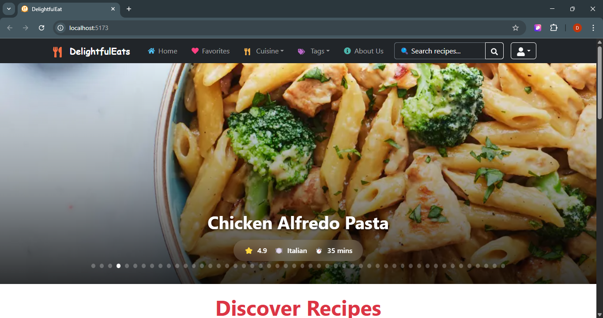
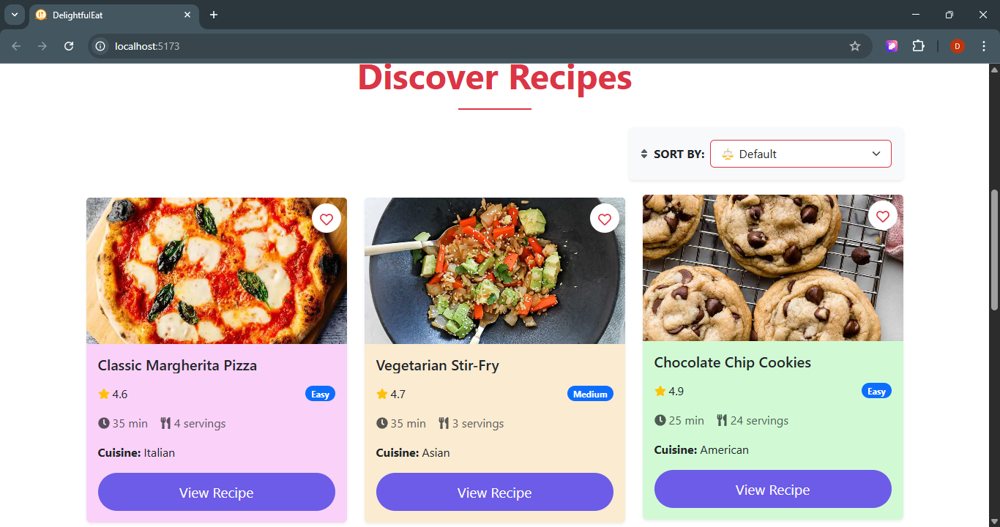
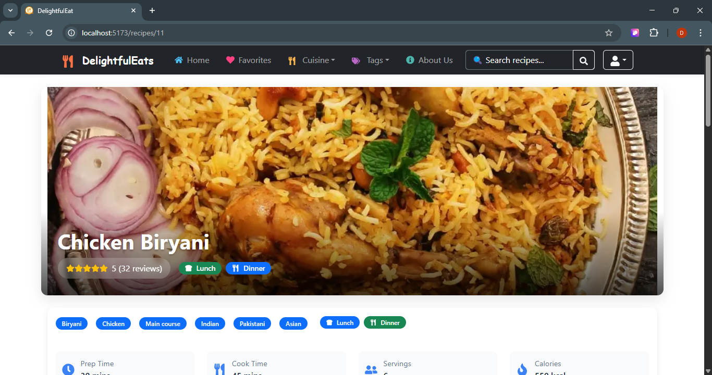
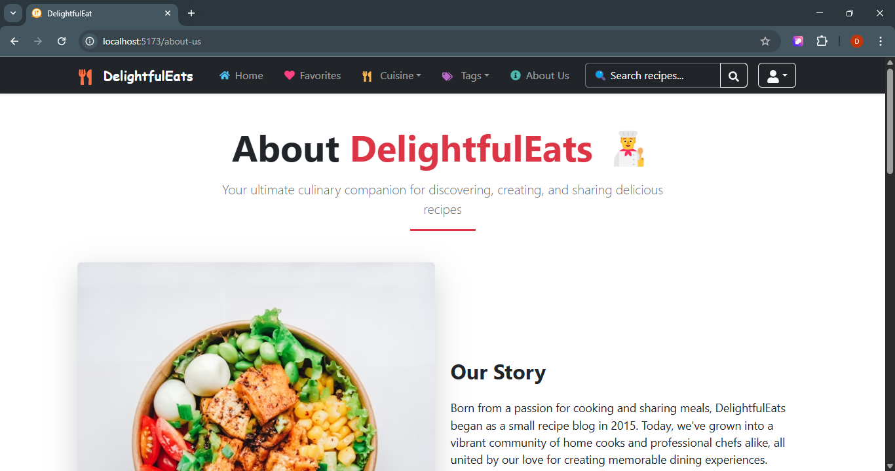
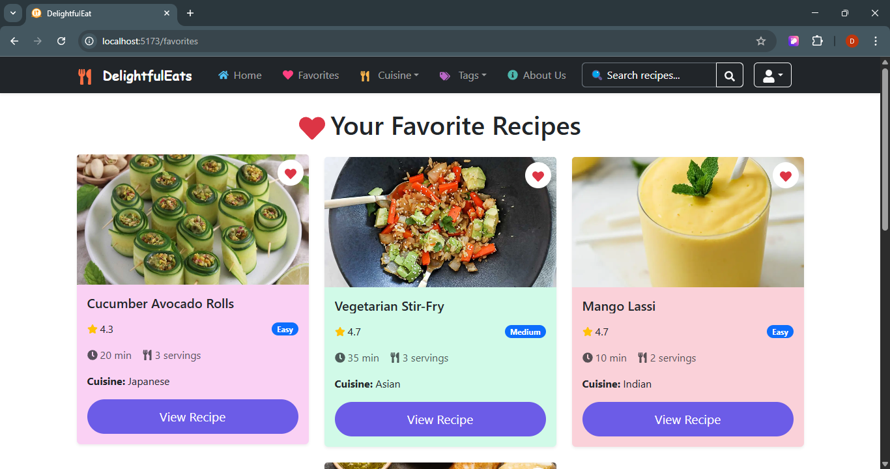

```markdown
# 🥗 DelightfulEats

**DelightfulEats** is a React-based web application that allows users to explore, view, and favorite delicious recipes. It provides a user-friendly interface with dynamic filtering, feedback forms, and rich recipe details — all fetched from an external API.

---

## 🚀 Features

- 🔍 **Search & Filter** recipes by name, cuisine, and tags  
- 📖 **Detailed Recipe Pages** with ingredients, instructions, and ratings  
- 💖 **Favorites List** to save recipes you love  
- 📝 **Feedback Form** to share suggestions  
- 🎠 **Carousel Section** for featured recipes  
- ⚡ **Responsive UI** with Bootstrap and Styled Components  
- 📦 **Fast Development** with Vite build tool  
- 🔔 **Toast Notifications** with React Toastify  

---

## 🛠️ Tech Stack

| Category       | Tools / Libraries                                       |
|----------------|---------------------------------------------------------|
| Frontend       | React (v19), Vite, React Router                         |
| Styling        | React Bootstrap, Styled Components, Bootstrap Icons     |
| State & Logic  | React Hooks, Context API                                |
| Notifications  | React Toastify                                          |
| Icons          | React Icons                                             |
| API            | [dummyjson.com/recipes](https://dummyjson.com/recipes) |

---

## 📁 Project Structure

```
DelightfulEats/
├── public/                # Static assets
├── src/
│   ├── assets/            # Images, CSS
│   ├── comman/            # Shared UI components (Header, Footer, Loader)
│   ├── Components/        # RecipeCard, RecipeList, etc.
│   ├── Footerpages/       # HelpCenter, Feedback, PrivacyPolicy
│   ├── pages/             # Home, AboutUs, RecipeDetails, Favorites
├── .gitignore
├── package.json
├── vite.config.js
├── README.md
```

---

## 📸 Screenshots

### Main Views

| Home Page | Recipe Details (Top) | Recipe Details (Bottom) |
|-----------|----------------------|--------------------------|
|  |  |  |

### Additional Features

| Favorites Page | About Us Page | Recipe Submission |
|----------------|----------------|-------------------|
|  |  |  |

---

## 📦 Installation

### 1. Clone the repository

```bash
git clone https://github.com/your-username/DelightfulEats.git
cd DelightfulEats
```

### 2. Install dependencies

```bash
npm install
```

### 3. Start development server

```bash
npm run dev
```

Visit the app at `http://localhost:5173`.

---

## 🌐 API Source

All recipe data is fetched from [dummyjson.com/recipes](https://dummyjson.com/recipes).

---

## 🧠 React Concepts Used

- 🔹 Functional Components & Props  
- 🔹 State Management using `useState` and `useContext`  
- 🔹 Side Effects with `useEffect`  
- 🔹 Dynamic Routing with React Router (`useParams`, `useNavigate`)  
- 🔹 Controlled Forms for search and feedback  
- 🔹 Conditional Rendering for loading and empty states  
- 🔹 Lists & Keys via `map()`  
- 🔹 Styled Components, CSS Modules, and Bootstrap  
- 🔹 Toast Notifications and Icons  

---

## 📋 TODO / Future Enhancements

- [ ] Add user authentication (Login/Signup)
- [ ] Enable recipe submission with image upload
- [ ] Add unit and integration testing (Jest + React Testing Library)
- [ ] Improve accessibility (ARIA support)
- [ ] Lazy load components for performance

---

## 🤝 Contributing

Contributions are welcome!  
Please fork the repo and submit a pull request with a clear description of your changes.

---

## 📄 License

This project is licensed under the [MIT License](LICENSE).

---

## 👨‍💻 Author

**Dipak Vidani**  
[LinkedIn](www.linkedin.com/in/dipak-vidani-b546492b4) • [GitHub](https://github.com/dipakvidani)

---

> Built with ❤️ using React, Vite, and Bootstrap.
```

---

Let me know if you want me to:
- Add Shields.io badges (React version, license, etc.)
- Include instructions for deployment (like Netlify or Vercel)
- Create a sample `LICENSE` file for you  
Happy to help polish it further!
